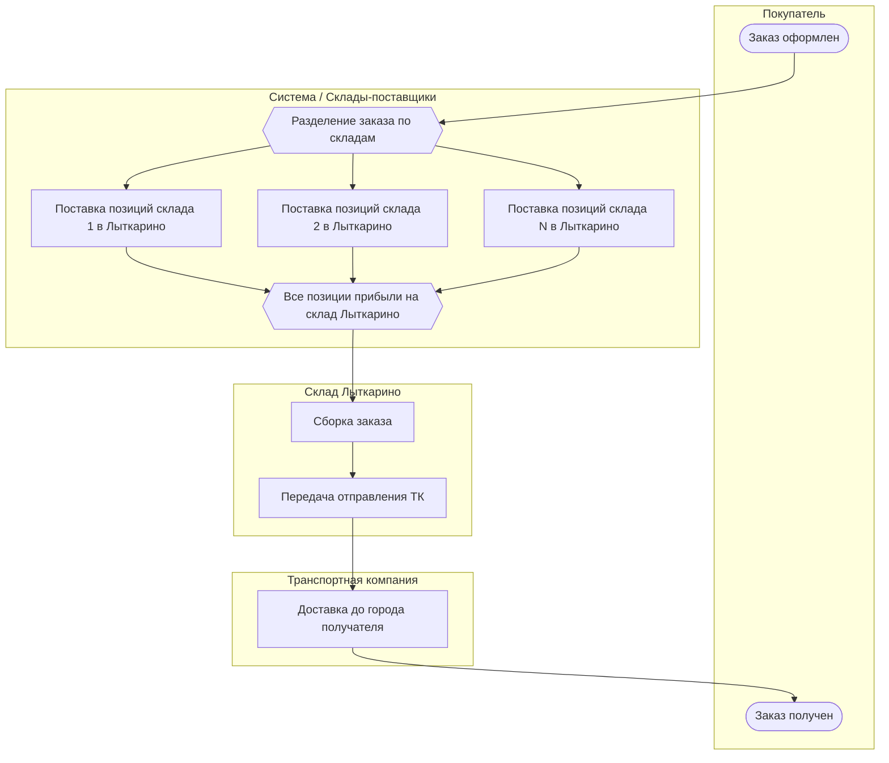
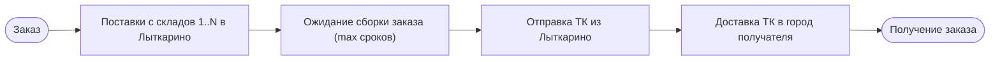

# BPMN: процесс доставки заказа с консолидацией в Лыткарино

Итоговый срок доставки = **макс(сроки поставки на склад Лыткарино)** + **срок доставки ТК** до города получателя.

## Диаграмма (Mermaid)

## Упрощённый вид (один поток по срокам)

## Легенда

| Элемент | Описание |
|--------|----------|
| **Разделение по складам** | Заказ может содержать позиции с разных складов; каждая часть идёт своим сроком поставки на Лыткарино. |
| **Все позиции прибыли** | Параллельное слияние (AND): отправка возможна только когда все части заказа на складе в Лыткарино. |
| **Сборка заказа** | Формирование единой отправки на складе Лыткарино. |
| **Доставка ТК** | Этап, который показывает калькулятор в карточке товара: тарифы и сроки от Лыткарино до города получателя (DPD, СДЭК и др.). |

Файл BPMN 2.0 (XML) для импорта в Camunda Modeler / bpmn.io: `delivery-process.bpmn`.
